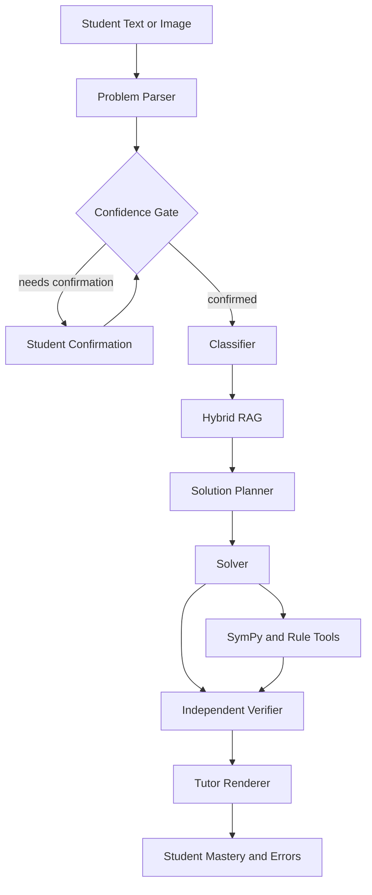

# SignalTutor

SignalTutor 是面向考研《信号与系统》的多模态、可验证 AI 辅导系统。它不是一个直接把题目交给聊天模型的壳，而是由代码控制的固定工作流：

```text
parse → classify → retrieve → plan → solve → verify → render → persist
```

V0.1 已提供文字题、截图上传、上下文追问、管理员发放账号、账号级学习记录隔离、详细/简洁/提示三种回答方式、解法批改、回答评价、同类题、薄弱考点针对练习、严格校验、错题本再次提问、本地多会话历史、符号工具、ROC 与终值规则、知识检索、掌握度记录、FastAPI API 和 Next.js 学习工作台。

## Architecture



核心边界：

- `src/signaltutor/workflows/solve_problem.py` 明确控制步骤和重试上限。
- `src/signaltutor/agents/` 把模型能力限制在结构化角色中。
- `src/signaltutor/tools/` 返回带 `evidence_id` 的确定性工具结果。
- `src/signaltutor/math/conventions.py` 同时提供给 Solver 和 Verifier。
- `src/signaltutor/rag/` 默认加载自编 JSONL seed；数据库不可用时仍能测试。
- `src/signaltutor/storage/` 校验真实图片格式、大小、像素数与 EXIF，不信任扩展名。
- `src/signaltutor/db/models.py` 包含题目、对话、知识、学情、AgentRun 与 ToolCall 表。

## Repository layout

```text
apps/api/                 FastAPI entry point
apps/web/                 Next.js student workbench
src/signaltutor/agents/   Parser, classifier, planner, solver, verifier, tutor
src/signaltutor/tools/    Convolution, Laplace, Fourier, Z and rule tools
src/signaltutor/rag/      Seed repository and retrieval
src/signaltutor/db/       SQLAlchemy models and repositories
src/signaltutor/storage/  Safe local image storage
src/signaltutor/students/ Mastery updates
knowledge/seed/           Original concept, solution and error cards
evals/                    30-case deterministic benchmark
tests/                    Unit and integration tests
alembic/                  Database migration
```

## Quick start: offline mode

Offline mode does not call paid APIs and supports the required convolution、missing ROC、student error and image confidence-gate checks.

Requirements: Python 3.12+ and Node.js 22+.

```bash
python -m venv .venv
source .venv/bin/activate
pip install -e '.[dev]'
cp .env.example .env
```

For a zero-infrastructure local run, change `DATABASE_URL` in `.env`:

```env
DATABASE_URL=sqlite+aiosqlite:///.var/signaltutor.db
AGENTS_DISABLE_TRACING=1
USE_FAKE_MODELS=true
```

Then start the backend:

```bash
mkdir -p .var
alembic upgrade head
uvicorn apps.api.main:app --reload
```

In another terminal:

```bash
cd apps/web
pnpm install
pnpm dev
```

Open [http://localhost:3000](http://localhost:3000). API docs are at [http://localhost:8000/docs](http://localhost:8000/docs).

学生端只允许登录，不开放自行注册。打开 [http://localhost:3000/admin](http://localhost:3000/admin)，输入 `.env` 中的 `ADMIN_API_KEY`，即可创建学生账号、重置密码或停用账号。创建成功后页面只显示一次初始密码，请立即复制并发给学生。

## Docker start

```bash
cp .env.example .env
docker compose up -d db redis
alembic upgrade head
docker compose up --build api web
```

PostgreSQL uses the `pgvector/pgvector:pg17` image. The first migration enables the `vector` extension and creates the V0.1 schema.

## Qwen mode

Set an Alibaba Cloud Model Studio API key in `.env`:

```env
DASHSCOPE_API_KEY=your-key
DASHSCOPE_BASE_URL=https://dashscope.aliyuncs.com/compatible-mode/v1
USE_FAKE_MODELS=false
```

The default model allocation is `qwen3.7-plus` for vision and core tutoring tasks,
`qwen3.7-flash` for low-cost classification, and `qwen3.8-max` for difficult-case
fallback. The base URL above is the shared Beijing endpoint; use the endpoint matching
the API key's region when the key was created elsewhere.

The model adapter uses DashScope's OpenAI-compatible Chat Completions API while keeping
the Agents SDK structured `output_type` workflow. Image bytes are sent directly as an
`input_image` alongside parser instructions, so the architecture is vision-first rather
than OCR-first.

Third-party tracing is disabled by default through `AGENTS_DISABLE_TRACING=1`. Student
images and full problem text are not written to ordinary logs.

## Environment variables

| Variable | Purpose |
| --- | --- |
| `ENV` | Runtime environment name |
| `DASHSCOPE_API_KEY` | Server-only Alibaba Cloud Model Studio API key |
| `DASHSCOPE_BASE_URL` | Regional OpenAI-compatible DashScope endpoint |
| `QWEN_MODEL_CHAT` | Fast single-call text and image chat model |
| `QWEN_MODEL_VISION` | Vision parser model |
| `QWEN_MODEL_CLASSIFIER` | Low-cost classifier model |
| `QWEN_MODEL_TUTOR` | Teaching renderer model |
| `QWEN_MODEL_SOLVER` | Solver and planner model |
| `QWEN_MODEL_VERIFIER` | Independent verifier model |
| `QWEN_MODEL_HARD_FALLBACK` | Optional difficult-case fallback |
| `DATABASE_URL` | SQLAlchemy async URL |
| `REDIS_URL` | Optional cache URL; V0.1 can run without it |
| `UPLOAD_DIR` | Local development image directory |
| `LEARNING_STORE_PATH` | Local persistent mistake-book and mastery store |
| `ACCOUNT_STORE_PATH` | Local account and password-hash store |
| `AUTH_SECRET` | Server-only login-token signing secret; use a long random value in production |
| `ADMIN_API_KEY` | Server-only key used to enter the account management page |
| `ACCESS_TOKEN_TTL_SECONDS` | Login validity in seconds; default is seven days |
| `MAX_IMAGE_BYTES` | Upload byte limit |
| `VISION_CONFIDENCE_THRESHOLD` | Default confirmation threshold, `0.85` |
| `MAX_SOLVER_RETRIES` | Maximum normal solver retries |
| `MODEL_REQUEST_TIMEOUT_SECONDS` | Hard timeout for a direct Qwen response |
| `ENABLE_HARD_MODEL_FALLBACK` | Enables configured hard fallback |
| `AGENTS_DISABLE_TRACING` | Disables Agents SDK tracing when `1` |
| `USE_FAKE_MODELS` | Forces deterministic offline mode |
| `CORS_ORIGINS` | Comma-separated frontend origins |
| `NEXT_PUBLIC_API_BASE_URL` | Browser-visible API base URL |

## API

| Method | Route | Purpose |
| --- | --- | --- |
| `GET` | `/health` | Health and model mode |
| `POST` | `/api/v1/auth/login` | Student login with an issued account |
| `GET` | `/api/v1/auth/me` | Current authenticated student |
| `GET/POST` | `/api/v1/admin/accounts` | List or create accounts with `X-Admin-Key` |
| `POST` | `/api/v1/problems/parse-text` | Parse and save text |
| `POST` | `/api/v1/problems/upload` | Validate, store and vision-parse an image |
| `POST` | `/api/v1/problems/{id}/solve` | Run the verified workflow |
| `POST` | `/api/v1/problems/{id}/solve/stream` | Emit safe, post-verification SSE events |
| `POST` | `/api/v1/chat` | Direct text solve |
| `GET` | `/api/v1/students/me/mastery` | Current student's topic mastery |
| `GET` | `/api/v1/students/me/errors` | Current student's recorded error patterns |
| `GET` | `/api/v1/students/me/overview` | Current student's mistake book and overview |
| `POST` | `/api/v1/feedback` | Helpfulness and correctness feedback |

Except for `/health`, login and administrator routes, student APIs require an `Authorization: Bearer <token>` header. The backend always obtains the student identity from this token; student APIs do not accept a client-selected student number.

### Create an account and log in

```bash
curl -s http://localhost:8000/api/v1/admin/accounts \
  -H 'Content-Type: application/json' \
  -H 'X-Admin-Key: <your-admin-key>' \
  -d '{"username":"student01","display_name":"张同学","password":"initial-password"}'

curl -s http://localhost:8000/api/v1/auth/login \
  -H 'Content-Type: application/json' \
  -d '{"username":"student01","password":"initial-password"}'
```

### Text solve example

```bash
curl -s http://localhost:8000/api/v1/chat \
  -H 'Content-Type: application/json' \
  -H 'Authorization: Bearer <student-token>' \
  -d '{
    "content": "已知连续时间 LTI 系统，x(t)=e^{-2t}u(t)，h(t)=e^{-t}u(t)，求零状态响应 y(t)。",
    "mode": "full_solution"
  }'
```

### Upload screenshot example

```bash
curl -s http://localhost:8000/api/v1/problems/upload \
  -H 'Authorization: Bearer <student-token>' \
  -F 'file=@problem.png'
```

If the parser confidence is below `0.85` or any `uncertain_elements` remain, the response status is `needs_confirmation`. Submit the edited `problem_parse` as `confirmed_problem` to the solve endpoint.

## Tests and quality checks

```bash
pytest -q
ruff check .
alembic upgrade head
```

Frontend:

```bash
cd apps/web
pnpm lint
pnpm build
```

Live Qwen tests are opt-in and must not run in CI:

```bash
pytest -m live
```

Run the deterministic benchmark:

```bash
python evals/run_eval.py
```

## Security and privacy

- There is no public registration route. Accounts are created only with the administrator key.
- Passwords are stored as salted `scrypt` hashes, never as plaintext.
- Student identity comes from signed, expiring login tokens. Resetting a password or disabling an account immediately revokes prior tokens.
- Account files are written with owner-only permissions. Back up `.var/accounts.json` and `.var/learning.json` together.
- Accepted images: JPEG, PNG and WEBP.
- MIME and actual decoded format must agree.
- Storage filenames are UUIDs; the supplied filename never becomes a path.
- Images are normalized and capped by bytes, dimensions and total pixels.
- PostgreSQL stores only the storage key and metadata, not image binaries.
- Before production, set `ENV=production` and replace both `AUTH_SECRET` and `ADMIN_API_KEY` with different strong random values. The backend refuses to start in production with development defaults.
- Public deployments still need HTTPS, reverse-proxy rate limiting, retention rules, malware scanning and object storage lifecycle policies.

## Known limitations

- The deterministic offline solver intentionally covers only the V0.1 acceptance paths and selected basic tools. Other subjects require a configured model or additional deterministic adapters.
- Real vision accuracy and configured model availability depend on the Model Studio account, region and selected Qwen model.
- PostgreSQL hybrid retrieval has a portable in-memory implementation and pgvector-ready schema, but production ranking weights and embedding backfill require domain evaluation.
- Guided mode returns the next Socratic question; long-lived conversation persistence is represented in the schema but the V0.1 UI keeps state in the current page session.
- Redis caching and hard-model escalation are configuration boundaries for the next iteration; they are not active in offline mode.
- The local in-memory API repositories are appropriate for tests and a single process. Production should switch these dependencies to SQLAlchemy repositories.
- The JSON account and learning stores support a single backend process. Multiple API replicas should use a shared transactional database instead.

## Next steps

1. Calibrate vision confidence on real exam screenshots and handwriting.
2. Add deterministic solvers for DTFT, rational inverse Z transform by ROC, sampling and state space.
3. Implement PostgreSQL hybrid query scoring and Qwen embedding ingestion.
4. Persist guided conversations, agent runs and tool evidence through SQL repositories.
5. Expand the benchmark with school-specific but properly licensed examples.
